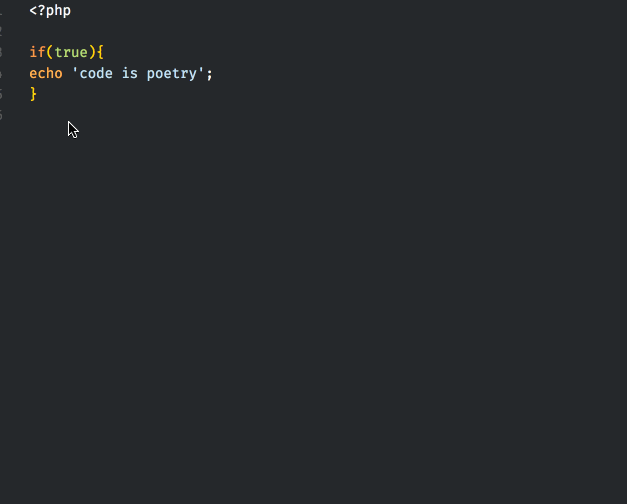

# PHP Code Beautifier and Fixer for Visual Studio Code

This extension provides the PHP Code Beautifier and Fixer (`phpcbf`) command.

## Features

`phpcbf` is the lesser known sibling of `phpcs` ([PHP_CodeSniffer](https://github.com/squizlabs/PHP_CodeSniffer)). `phpcbf` will try to fix and beautify your code according to a coding standard.

## Preview
>
>###### right mouse-click, in  context menu, select 'Format Document'. Here using the `WordPress-Core` standard.

## Requirements

phpcbf must be installed. phpcbf is installed when you [install phpcs](https://github.com/squizlabs/PHP_CodeSniffer#installation).

## Extension Settings

This extension contributes the following settings:

* `phpcbf.enable`: [ Optional | Default: true ] enable/disable this extension.
* `phpcbf.executablePath`: [ Optional | Default: phpcbf ] Can be:
	* `./vendor/bin/phpcbf`
	* `phpcbf.bat`
	* `/usr/local/bin/phpcbf`
	* etc
* `phpcbf.documentFormattingProvider`: [ Optional | Default: true ]  Register PHP document formatting provider, right mouse-click context menu, select 'Format Document'
* `phpcbf.onsave`: [ Optional | Default: false ]. Run `phpcbf` on save.
* `phpcbf.standard`: [ Optional | Default: null ]. The formatting standard.
	* When `null`, phpcbf will use, if it's set, the `default_standard`, otherwise fallback to `Pear`.
	* By default, the following standards are available: `PEAR`, `Zend`, `PSR2`, `MySource`, `Squiz` and `PSR1`
	* If you add a standard to phpcs, it will be available for phpcbf, eg the [Drupal](https://github.com/klausi/coder), [WordPress](https://github.com/WordPress-Coding-Standards/WordPress-Coding-Standards), [Yii2](https://github.com/yiisoft/yii2-coding-standards), and [Magento](https://github.com/magento/marketplace-eqp) extensions.
	* You can also point to a phpcs.xml rules file, eg: `"phpcbf.standard": "/file/path/phpcs.xml"`

The default settings are

```json
{
	"phpcbf.enable": true,
	"phpcbf.executablePath": "phpcbf",
	"phpcbf.documentFormattingProvider": true,
	"phpcbf.onsave": false,
	"phpcbf.standard": null
}
```

## Known Issues

This is the first release of my first vscode extension, you're warned :)

## Release Notes

### 0.0.1

Initial release
